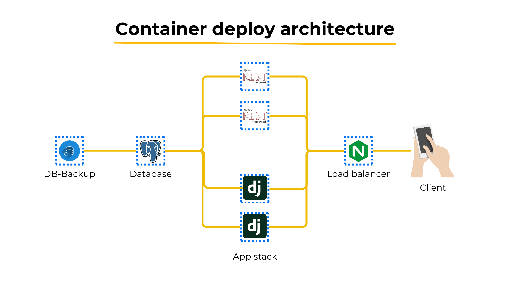

# Budapest Junction 2023 - THE ZOLDYCKS TEAM

Welcome to the official repository for THE JUNCTION BUDAPEST 2023 HACKATHON, Crufthub Challenge I - "Be a brand ambassador and connect young adults with telecom services!" The ZOLDYCKS TEAM is excited to present our innovative project, ATCHO.

## Project Overview

**Youtube Video for ATCHO Project:** [Watch Video](https://www.youtube.com/watch?v=Qgg5qsUbaVg&ab_channel=TheZoldycks)

**Pitch Deck Presentation:** [View Presentation](https://www.canva.com/design/DAF1L-WNRsE/NSmM_xIZG7qhR3OWAXrzQg/view?utm_content=DAF1L-WNRsE&utm_campaign=designshare&utm_medium=link&utm_source=editor)

## Repository Information

### 1. Back End Services
**Repo Code:** [Z-App-Core](https://github.com/TheZoldycs/atcho-backend)

This repository contains the back-end services for the ATCHO project. For detailed information on setting up, configuration, and usage, please refer to the accompanying README file.

### 2. Mobile Application - Atcho App
**Repo Code:** [Atcho-Mobile](https://github.com/TheZoldycs/atcho_mobile)

Here, you'll find the codebase for the Atcho mobile application. Follow the provided README for instructions on installation, development, and any additional features.

## Design Assets

### 1. Figma Atcho App
**Figma Link:** [View Figma Design](https://www.figma.com/file/PtVupBJFbdv1gYQwJfZesT/chllng-bd?type=design&node-id=1%3A298&mode=design&t=JkxPI01dHVIEMJJx-1)

Explore the Figma design for the Atcho app to get insights into the user interface and user experience aspects of our project.

---

## Getting Started

To contribute or explore our project, follow these steps:

1. Clone the respective repositories:
   - Back End Services: `git clone https://github.com/TheZoldycs/atcho-backend.git`
   - Mobile Application: `git clone https://github.com/TheZoldycs/atcho_mobile.git`

2. Refer to the README files in each repository for specific instructions on setup, configuration, and contribution guidelines.

3. If you have any questions or feedback, feel free to contact us through the provided channels in the pitch deck.

---

## Contact Information

For inquiries, collaboration, or feedback, please reach out to us through the contact information provided in the pitch deck presentation.

Thank you for your interest and support!

*THE ZOLDYCKS TEAM*
